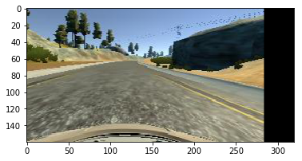

# Behavior Cloning Project
The goals / steps of this project are the following:
* Use the simulator to collect data of good driving behavior
* Build, a convolution neural network in Keras that predicts steering angles from images
* Train and validate the model with a training and validation set
* Test that the model successfully drives around track one without leaving the road
* Summarize the results with a written report

## Project Resources
The following resources were provided apriori
* Simulator to generate and test performance of the model
* drive.py file to test the model record frames
* video.py file to convert images to mp4 file
* Template for writeup


** Model Architecture **
The nvidia model described here(https://images.nvidia.com/content/tegra/automotive/images/2016/solutions/pdf/end-to-end-dl-using-px.pdf) was used. I tried to use a different model but was not able to consistently improve its performance

## Data Collection
The data was collected by driving normally on Track 1. Some recovery behaviors were also recorded. Approximately 50000 images were recorded. Car was not driven counterclockwise. Recovery behaviours were also not recorded


## Data augmentation
### Brightness Scaling
Images were converted into HSV format and the Value channel was additively scaled to add more variation to the data. I clipped the value channel to 128 to prevent brightness artifacts while converting back to RGB.


### Random Translation
A random translation was added to the input images Steering values were modified in proportion to the translation



### Cropping
50 pixels from the top and 20 pixels from the bottom were cropped. This was done using keras.Cropping 2D in the model itself


### Submission details
My project includes the following files:
* model.py containing the script to create and train the model
* drive.py for driving the car in autonomous mode
* model.h5 containing a trained convolution neural network 
* writeup.md or writeup_report.pdf summarizing the results
* video.mp4 and graphics_generalization.mp4 showcasing model driving on track 1


### How to test

Using the Udacity provided simulator and my drive.py file, the car can be driven autonomously around the track by executing 
```sh
python drive.py model.h5
```

### Description of Code
The model.py file contains the code for training and saving the convolution neural network. The file shows the pipeline I used for training and validating the model, and it contains comments to explain how the code works.

#### How to use code
```` sh
python model.py
````
* The code expects at least one of two folders relative to its own path ../../data_aug or ../../data_raw 
* If the 'augment' variable in the code is set to false, Data will be loaded from raw and a model will be trained from scratch
* If the 'augment' variable in the code is set to true the code will load the last saved model and augmentation data in data_aug and model will be fine tuned.
* All epochs are saved and tensorboard logs are also created.


### Model Details
Dropout layers were added to all the dense layers of the stanard nvidia model for reducing overfitting
The model used an adam optimizer, so the learning rate was not tuned manually


### Augmentation Strategy
Model was trained on initial set of center driving and was able to negotiate the first few curves on track 1. The specific failure turns and points were recorded into the data_aug folder. Saved model was loaded and fine tuned till it was able to cross failure points. The process was repeated till the trained model could drive around the whole track without failure

### Model Choice and Justification
I used the nvidia model because of its proven performance on Real world data. I eventually want to port this model onto a real self driving car and thought that this should be a good starting point. I began by only adding dropout to the last dense layer. I found that the performance on curves improved with adding dropouts to the dense layers but stayed the same or degraded by adding the dropouts to conv layers.

After adding the dropout layers, training loss was higher than validation loss. This meant that the model was now underfitting. Practical deployment however showed that underfit models showed superior performance on the track as opposed to overfit ones


### Future work

* Try out more models
* Figure out strategies for track 2
* Implement a custom layer to resize the images in the model itself


```python

```
